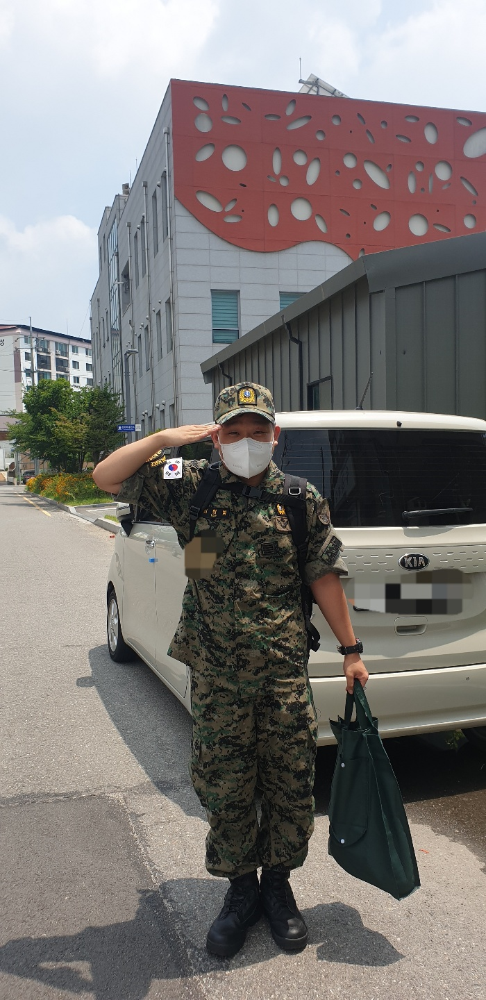

# Lee Hee Bum 😎

## Career
* 2019.03.04~ [Konkuk University, Major: Applied Statistics](https://stat.konkuk.ac.kr) (Now, Bachelor's Degree 3rd grade)
* 2020.04.07~ [Konkuk University Data Science Club(by Python) Kuggle](https://cafe.naver.com/kuggler)
* 2020.04.08~ [Konkuk University Data Science Club(by R) Kustar](https://cafe.naver.com/kustar20)

## 병역(Military Service)
* 2021.01.11 ~ 2022.07.10 육군특수전사령부 11공수특전여단 병장 만기전역
(ROK Special Force 11th Special Force Brigade Sgt. Expiration Discharge)

### Links

### Techs

#### 그래도 좀 침(pretty good)

#### 배우는 중(currently learning)

#### 혐오함(extremly hate)

### 통합 개발 환경(IDE)

#### 그래도 좀 침(pretty good)

#### 배우는 중(currently learning)

### 저장소(Archives)

#### 배우는 중(currently learning)

 

